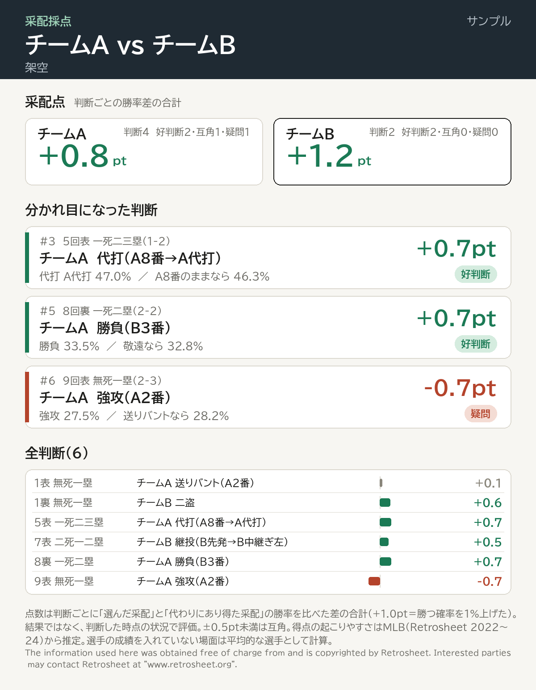

# X投稿フォーマット

試合ごとの采配採点を、毎日同じ形でXに出すための決まりごと。画像と本文はコマンドで自動生成し、投稿だけを人が行う。

## 1. 1投稿の中身

| 項目 | 決まり |
| --- | --- |
| 単位 | 1試合につき1投稿 |
| 画像 | **原則1枚**（1200×最大1600、縦3:4まで）。判断が多くて収まらない日だけ2枚目に「全判断」を回す。3枚以上にはしない |
| 本文 | 定型5行。全角換算140字（Xの280単位）以内 |
| 時刻 | **試合終了後**。試合中には出さない（NPBの規程が試合中の試合データ送信を禁じているため） |
| 自動投稿 | しない。生成物を確認して手で投稿する |

## 2. 画像の構成（上から順に固定）

見本（架空の試合）：



| 順 | 区画 | 載せる内容 | 決まり |
| --- | --- | --- | --- |
| 1 | 見出し | 「采配採点」、日付と曜日、対戦（ビジター vs ホーム）、結果と球場 | 結果・球場は試合ノートの属性から |
| 2 | 采配点 | チームごとの合計pt、判断数、好判断・互角・疑問の数 | 合計が上のチームを黒枠で強調。プラスは緑、マイナスは赤 |
| 3 | 分かれ目になった判断 | 最大3件。場面、チーム、采配と対象選手、選んだ方と代わりの勝率、pt、判定 | ±0.5pt以上の判断から差の大きい順に選び、試合の順に並べる。入りきらない日は2件→1件に減らす |
| 4 | 全判断 | すべての判断を試合順に1行ずつ。場面、チームと采配、損得の棒、pt | 棒は0を中心に左が損、右が得 |
| 5 | 注記 | 点数の意味、評価の前提、Retrosheetの帰属表示 | **毎回必ず載せる**（帰属表示はRetrosheetの利用条件） |

色は得（緑）・損（赤）・互角（灰）の3つだけ。球団の色・ロゴ・写真は使わない。

## 3. 本文の定型

```
【采配採点】{月/日} {結果}
采配点 {上位チーム} {+x.x}／{下位チーム} {±x.x}
分かれ目：{回・表裏 アウト走者（得点）} {チーム}の{采配（対象選手）} {±x.x}pt
※結果ではなく判断した時点の勝率で評価
#采配採点
```

- 「分かれ目」は画像の分かれ目のうち差が最も大きい1件。±0.5pt以上の判断が1つもない日は「両軍とも采配で大きな損得はなし」
- 字数を超える日は「※」の行から削る

実例（2026年8月30日 DeNA 4-3 中日）：

```
【采配採点】8/30 DeNA 4-3 中日（9回裏サヨナラ）
采配点 DeNA +9.2／中日 -2.9
分かれ目：8回裏 二死二三塁（3-2） 中日の敬遠（エンカーナシオン） -4.4pt
※結果ではなく判断した時点の勝率で評価
#采配採点
```

## 4. 用語と判定

| 用語 | 意味 |
| --- | --- |
| pt | 「選んだ采配」と「代わりにあり得た采配」の勝率の差。+1.0ptは勝つ確率を1%上げた |
| 采配点 | その試合のチームの判断のptの合計 |
| 好判断／互角／疑問 | +0.5pt以上／±0.5pt未満／-0.5pt以下。表示上の区切りで、統計的な基準ではない |
| 対象の采配 | 送りバント・二盗・三盗・敬遠・代打・継投と、それをしなかった判断（強攻・二盗せず・三盗せず・勝負・代打なし・続投） |

## 5. 毎日の手順

1. `試合/_テンプレート.md` をコピーして試合ノートを作り、判断の**直前**の場面を書く
2. 次を実行する（試合ノートの隣に採点レポート・画像・本文ができる）

   ```
   python -m saikaku.game "試合/2026-08-30_DeNA-中日.md"
   ```

3. Obsidianで `〜_採点.md` を開き、下のチェックをする
4. `〜_1.png`（と `〜_2.png`）と本文を手でXに投稿する

## 6. 投稿前チェック

- [ ] 場面（回・表裏・アウト・走者・得点）が実際の試合と合っている
- [ ] 選手名の表記が正しい
- [ ] 採点レポートの「確認してほしいこと」が空、または内容を理解したうえで出す
- [ ] 「対象外」になった判断があれば、その理由を把握している
- [ ] 試合は終わっている
- [ ] 画像にRetrosheetの帰属表示が入っている

## 7. 載せないもの

- 試合経過の記事文、NPB・球団・報道の文章・画像・ロゴ
- 手入力した選手の成績の数字そのもの（画像にも本文にも出ない作りにしてある）
- 試合中の速報

## 8. 読み手に誤解されやすい点（現時点の限界）

投稿の数字はこの前提で読む。改善はTODOで管理している。

- 盗塁の評価は甘め。MLBの盗塁成功率（2024年で約80%）をそのまま使っている
- 選手の成績を入れていない選手は平均的な選手として計算する。敬遠や代打の狙い（次の打者のほうが弱い等）は、成績を入れないと点数に表れない
- 投手の打撃は「非力」で代用しており、投手への代打の効果を小さく見積もる。先発を降ろす損も数えていない
- 代走・守備固めは採点しない
- 得点の起こりやすさはMLBから推定しており、NPBの得点環境との差は補正していない

## 9. 未決事項

- 公開するかどうか、どのアカウントで出すか（[TODO.md](TODO.md)）
- 1日に複数試合あるとき、全試合を出すか注目の1試合にするか
